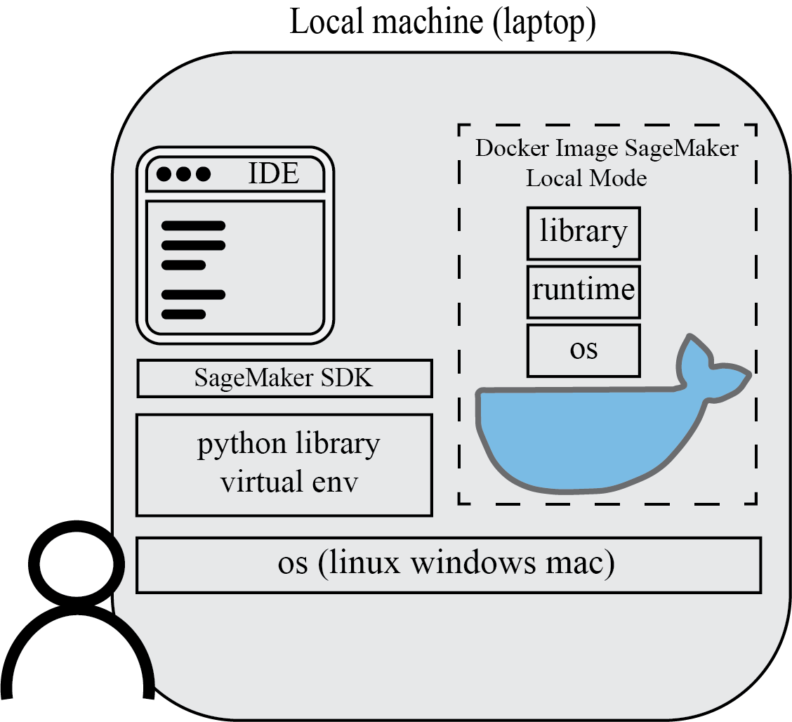
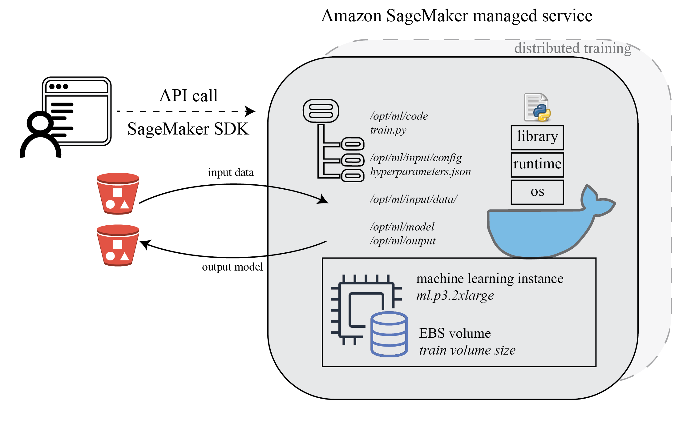
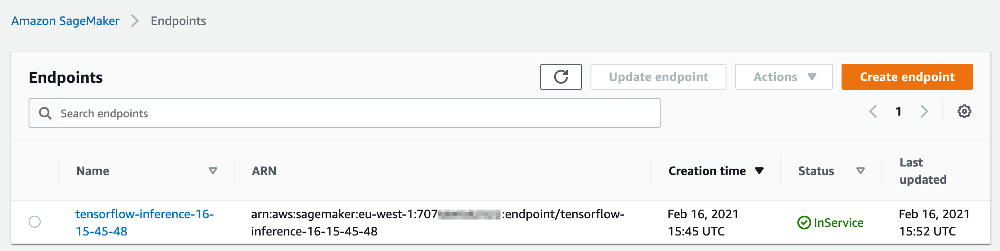

# TensorFlow with SageMaker on Pycharm

Amazon SageMaker is a fully managed machine learning service. With SageMaker, data scientists and developers can quickly and easily build and train machine learning models, and then directly deploy them into a production-ready hosted environment. 

In this demo, we will showcase how you can leverage SageMaker for managing your training jobs and experiments on AWS, using Amazon SageMaker Python SDK with your local IDE such as Pycharm. 

In order to run training jobs on AWS, you will need:

* An AWS account and configured with AWS CLI to have sufficient permission to run SageMaker training jobs
* Docker configured (SageMaker local mode) and Amazon SageMaker Python SDK installed on local computer
* (Optional) SageMaker Studio for experiment tracking and Amazon SageMaker Experiments Python SDK


Setup:

1. Create a new user with programmatic access that enables an access key ID and secret access key for the AWS CLI, attach permissions *AmazonSageMakerFullAccess* and *AmazonS3FullAccess* (limit the permissions to specific buckets if possible). You also need an execution role for SageMaker *AmazonSageMakerFullAccess* and *AmazonS3FullAccess*. SageMaker uses this execution role to perform operations on your behalf on the AWS hardware that is managed by SageMaker

2. Install AWS CLI on local computer and quick configuration with aws configure, see [Configuring the AWS CLI](https://docs.aws.amazon.com/cli/latest/userguide/cli-chap-configure.html)

   ```
   $ aws configure
   AWS Access Key ID [None]: AKIAI*********EXAMPLE
   AWS Secret Access Key [None]: wJal********EXAMPLEKEY
   Default region name [None]: eu-west-1
   Default output format [None]: json
   ```

3. Install [Docker](https://docs.docker.com/get-docker/) and your favorite local Python IDE. Here we use Pycharm. Make sure you have all required python libraries to run your code locally. Add SageMaker Python SDK to your local library. You can use pip install sagemaker (or create a virtual environment with venv for your project then install sagemaker within virtual environment). See the [documentation](https://sagemaker.readthedocs.io/en/stable/v2.html)

### Develop your ML algorithms on local computer

 *./tf_code/tf_script.py*

Many data scientists use local IDE for machine learning algorithm development, such as Pycharm. In this demo, the algorithm python script *tf_code/tf_script.py* is a simple file that uses TensorFlow keras to create a feedforward neural network. You can run the python script locally as you do usually. 


### Make your code SageMaker compatible

 *./tf_code/tf_script.py*

To make your code compatible for SageMaker, you need to follow certain rules for reading input data and writing output model and other artifacts. The training script is very similar to a training script you might run outside of SageMaker, but you can access useful properties about the training environment through various environment variables. See [SageMaker Toolkits Containers Structure](https://docs.aws.amazon.com/sagemaker/latest/dg/amazon-sagemaker-toolkits.html)

Input data location *SM_CHANNEL_{channel_name}*

```
SM_CHANNEL_TRAINING=/opt/ml/input/data/training
SM_CHANNEL_VALIDATION=/opt/ml/input/data/validation
SM_CHANNEL_TESTING=/opt/ml/input/data/testing
```

Model output location to save model artifact

```
SM_MODEL_DIR=/opt/ml/model
```

Output artifact location to write non-model training artifacts (e.g. evaluation results)

```
SM_OUTPUT_DATA_DIR=/opt/ml/output
```

You can pass these SageMaker environment variable as argument, so that you can still run the training script outside of SageMaker

```
# SageMaker default SM_MODEL_DIR=/opt/ml/model
if os.getenv("SM_MODEL_DIR") is None:
    os.environ["SM_MODEL_DIR"] = os.getcwd() + '/model'

# SageMaker default SM_OUTPUT_DATA_DIR=/opt/ml/output
if os.getenv("SM_OUTPUT_DATA_DIR") is None:
    os.environ["SM_OUTPUT_DATA_DIR"] = os.getcwd() + '/output'

# SageMaker default SM_CHANNEL_TRAINING=/opt/ml/input/data/training
if os.getenv("SM_CHANNEL_TRAINING") is None:
    os.environ["SM_CHANNEL_TRAINING"] = os.getcwd() + '/data'

if __name__ == '__main__':
    parser = argparse.ArgumentParser()
    parser.add_argument('--train', type=str, default=os.environ.get('SM_CHANNEL_TRAINING'))
    parser.add_argument('--model_dir', type=str, default=os.environ.get('SM_MODEL_DIR'))
    parser.add_argument('--output_dir', type=str, default=os.environ.get('SM_OUTPUT_DATA_DIR'))
    
```

### Test your ML algorithms on local computer with SageMaker SDK local mode

*./sm_local.py*

The SageMaker Python SDK supports local mode, which allows you to create estimators and deploy them to your local environment. This is a great way to test your deep learning scripts before running them in SageMaker’s managed training or hosting environments. Local Mode is supported for frameworks images (TensorFlow, MXNet, Chainer, PyTorch, and Scikit-Learn) and images you supply yourself.

```
sagemaker_role = 'arn:aws:iam::707684582322:role/RandomRoleNameHere'
sagemaker_session = LocalSession()
sagemaker_session.config = {'local': {'local_code': True}}

def sagemaker_estimator(sagemaker_role, code_entry, code_dir, hyperparameters):
    sm_estimator = TensorFlow(entry_point=code_entry,
                              source_dir=code_dir,
                              role=sagemaker_role,
                              instance_type='local',
                              instance_count=1,
                              model_dir='/opt/ml/model',
                              hyperparameters=hyperparameters,
                              output_path='file://{}/model/'.format(os.getcwd()),
                              framework_version='2.2',
                              py_version='py37',
                              script_mode=True)
    return sm_estimator
```

SageMaker local mode, you will have managed TensorFlow Image from service account to be donwloaded into your local compute and show up in Docker. This docker image is the same as in SageMaker’s managed training or hosting environments, so you can debug your code locally and faster. 




### Run your ML algorithms on AWS managed environment with SageMaker SDK

*./sm_train.py*

After you create the training job, SageMaker launches the ML compute instances and uses the training code and the training dataset to train the model. It saves the resulting model artifacts and other output in the S3 bucket you specified for that purpose.




### Organize, Track And Compare Your Machine Learning Trainings with Amazon SageMaker Experiments

SageMaker Experiments automatically tracks the inputs, parameters, configurations, and results of your iterations as *trials*. You can assign, group, and organize these trials into *experiments*. SageMaker Experiments is integrated with Amazon SageMaker Studio providing a visual interface to browse your active and past experiments, compare trials on key performance metrics, and identify the best performing models. See documentation for setting up [SageMaker Experiments](https://docs.aws.amazon.com/sagemaker/latest/dg/experiments.html)

Amazon SageMaker Experiments offers a structured organization scheme to help users group and organize their machine learning iterations.

* *Experiment* *:* a collection of *trials* that are observed, compared, and evaluated as a group

* Trial : a set of steps or trial components

* Trial component : manually or automatically tracking for SageMaker processing jobs, training jobs, and batch transform jobs. It can have a combination of inputs such as datasets, algorithms, and parameters, and produce specific outputs such as models, metrics, datasets, and checkpoints. 

Analytics with Amazon SageMaker Experiments and SageMaker Studio UX. 

### Deploy your trained ML model on SageMaker Endpoint for real-time inference 

*./sm_deploy.py*

SageMaker provides model hosting services for model deployment, as shown in the following diagram. SageMaker provides an HTTPS endpoint where your machine learning model is available to provide inferences.


